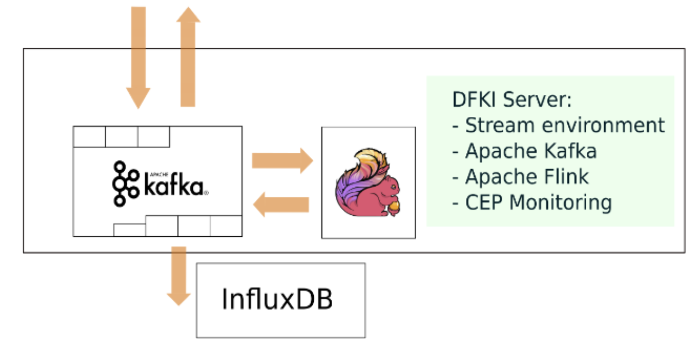

# Complex Event Processing (CEP) with Apache Flink

This repository is a muster from the Stream Processing Application as part of the
Pilot 2 in the
european research project, [**BigMedilytics**](https://www.bigmedilytics.eu/).
The whole platform as well as the UI application are part of the internal ecosystem
of the department of Kidney Diseases in the Charite Hospital Berlin. Due to the
sensitive data from patients, this repository only shows a small part of the
system, focus on the stream processing engine with Flink.


This application is designed to monitor stream data produced from patients with
wearable devices and check with Complex Event Processing algorithms if there is
an alarm in the measurements.


The core of the platform that connects the CEP pipeline with the patients and the
doctors is [MACSS](http://macss.dfki.de/), (Medical Allround-Care Service Solutions)
that proposes a new patient-centered smart electronic health care service platform with
partners from research, industry, health insurance companies, patient organizations
and health care service providers.


### Update March 2023

The project was written in 2020. Some dependencies could be depreciated. 
An issue will be open in case of someone wants to update dependencies if necessary.

Prerequisites:
* Basic understanding of Apache Flink DataStream API and how to run it locally
* Basic understanding of Apache Kafka and how to run it locally
* JSON data structures
* Java functional programing

## Project Environment

### Dependencies

* Apache Flink 1.9.0 - DataStream API
* Flink-connector-kafka 11_2.11
* flink-cep_2.1
* influxdb-java 2.9

To run this project will be necessary to have installed locally:
* [Apache Flink](https://nightlies.apache.org/flink/flink-docs-stable/docs/try-flink/local_installation/)
* [Apache Kafka](https://kafka.apache.org/downloads)

As previously said, it is necessary to check Kafka and flink version to make it compatible with the 
project dependencies. 

### Project arguments

the Kafka source is expecting the following parameters to be set

- "bootstrap.servers" (comma separated list of kafka brokers)
- "zookeeper.connect" (comma separated list of zookeeper servers)
- "group.id" the id of the consumer group
- "topic" the name of the topic to read data from.

As an example fo the arguments:

```agsl
--topic
Hello-Medizine
--outTopic
Bye-Medizine
--bootstrap.servers
localhost:9092
--zookeeper.connect
localhost:2181
--group.id
myGroup
--output_to
<your_path>/outputTest.txt
```

### Dataset

As we said before, the data from the patients is protected, therefore, to run the project 
it is necessary to generate our own dummy data. 

The data need to be generated and fed to Kafka consumer, locally. We have to choose **topic**
name for the data and then this topic name will be inserted in the arguments above. 

This data consist of a JSON file including relevant data produced for the patient with the 
device. As you can see in the example first JSON row, we have a `MACSSID` identity for the patients and in this case
the JSON shows a meassurement of `BW`, meaning Body Weight, in this case of `Amount` 58.0 kg. 

There is only 5 types of JSON as shown below:
* `BW`:  Body Weight
* `HR`: Heart Rate
* `BT`: Body Temperature
* `BP`: Blood Pressure
* `AD`: Adherence


The shape of the input data is as below (dummy example):

```json
{"MACSSID": "39","MACSSDownloadBodyWeightID": "25","MACSSObservationID": "30","Amount": 58.0,
 "Date": "2020-01-01T17:41:54","Source": "135","IngestionTime": 1542465270522,"Type": "BW"}
{"MACSSID": "39","MACSSDownloadHeartRateID": "25","MACSSObservationID": "30","Amount": 58.0,
 "Date": "2020-01-01T17:41:54","Source": "135","IngestionTime": 1542465270522,"Type": "HR"}
{"MACSSID": "39","MACSSDownloadBodyTempID": "25","MACSSObservationID": "30","Amount": 58.0,
 "Date": "2020-01-01T17:41:54","Source": "135","IngestionTime": 1542465270522,"Type": "BT"}
{"MACSSID": "39","MACSSDownloadBloodPressureID": "25","MACSSObservationID": "30", "AmountSystolic": 58.0, 
 "AmountDiastolic": 78.0,"Date": "2020-01-01T17:41:54","Source": "135","IngestionTime": 1542465270522,"Type": "BP"}
{"MACSSID": "39","MACSSDownloadAdherenceID": "25","MACSSObservationID": "30", "MedicamentType": 7.0,
 "Amount": 58.0,"Date": "2020-01-01T17:41:54","Source": "135","IngestionTime": 1542465270522,"Type": "AD"}

```

The output data after the monitoring will be as below:

```json
{"MACSSID":"12", "MACSSDownloadAdherenceID":"2", "Date":"2019-11-27T14:00:00", "Type":"AD", "Flag":1.0}
```
Notice that the output already shows the CEP analysis, showing the `"Flag"` field with an Integer.
More about flags explained below.

This repository doesn't include the data generator due to a policy from the BigMedilytics Project. 
If you want to generate your own data, it has to be exactly the same as shown in the JSON example above. But
to feed Kafka, you need to feed it one row at a time. 

**COMMON ERRORS**: Ingestion time. The ingestion time has to be progressive in time going forward. 
Also check the start date of the Timestamps and be sure that doesn't violate any constraint in the Flink
ingestion time configuration. 

**WARNING**: After the project start and Flink local cluster starts, if you want to feed the data again, and the
ingestion time is not older that the last JSON ingested, then will be error. For that, it is necessary to restart
the Flink cluster before ingesting the data again.

## Project structure



The image above shows the pipeline architecture. 

1. The data or messages are consumed by Kafka and then produced into Flink CEP monitoring engine. 
2. After the analysis, the results are sink back to Kafka to another topic. 
3. We also have the option to store the results in InfluxDB if need it. The repository has an API `main/java/Stream/Influx` 

### Complex Event Processing

[FlinkCEP](https://nightlies.apache.org/flink/flink-docs-release-1.16/docs/libs/cep/) 
is the Complex Event Processing (CEP) library implemented on top of Flink. It allows you to detect 
event patterns in an endless stream of events, giving you the opportunity to get hold of what’s 
important in your data.

The pattern API allows you to define complex pattern sequences that you want to extract from your input stream.

Below and example of the CEP pattern 

```java
//RED PATTERN
Pattern<Tuple7<String, String, Double, Double, Long, Long, String>, ?> MDPatternRed =
        Pattern.<Tuple7<String, String, Double, Double, Long, Long, String>>begin("first")
        .where(new MedicationPatterns.YellowPattern()).next("secondMatch")
        .where(new MedicationPatterns.YellowPattern()).next("flag")
        .where(new MedicationPatterns.YellowPattern()).within(Time.hours(TIME_RED_FLAG));
PatternStream<Tuple7<String, String, Double, Double, Long, Long, String>> MDMatchRed = CEP
        .pattern(MDYellow, MDPatternRed);
```

In our project we created a pattern for each measurement. The idea is to check the measurements values against
our pattern and trigger a **flag** depends on the results. 
These flags are represented with the integers: `1, 2, 3`. At the same time, these integers represent a colour
and for instance a level of alarm in the measurements results. 

* `1`: Green Flag, or normal values
* `2`: Yellow Flag, or warning
* `3`: Red Flag, or alarm

The logic behind the patterns where disused with the doctors based on medical knowledge. You can find the 
measurement values and their warning ranges in the file: `data/adherenceMetadata.txt`

Also, if you are more interested in this topic you can have a look to this [research](https://pubmed.ncbi.nlm.nih.gov/19194283/).

### Running the project
To run the project we need to have a local environment for the Flink cluster and Kafka. 
Then, you have to run the file `src/main/java/Stream/MainStream.java` with Flink and with the arguments ready. 
Once Flink local is running, we can start Kafka. We will consume our sample data (in the form of JSON) with Kafka and
Flink will be listening to the topic we produce. The results will be produced back to Kafka to the output topic
we set in the arguments. 

Below an example of my local execution:

```shell
#!/bin/bash
/home/savi01/kafka_2.11-1.1.0/bin/zookeeper-server-start.sh /home/savi01/kafka_2.11-1.1.0/config/zookeeper.properties &
sleep 5 
/home/savi01/kafka_2.11-1.1.0/bin/kafka-server-start.sh /home/savi01/kafka_2.11-1.1.0/config/server.properties &
sleep 5
/home/savi01/flink-1.9.1/bin/start-cluster.sh &
sleep 5
/home/savi01/flink-1.9.1/bin/flink run -c Stream.MainStream \
/home/savi01/dfki/bigMedalitics/teleMedizine/target/flink-quickstart-java-1.9.0.jar \
--topic Hello-Medizine2 --outTopic Bye-Medizine --bootstrap.servers localhost:9092 \
--zookeeper.connect localhost:2181 --group.id myGroup \
--output /home/savi01/dfki/bigMedalitics/teleMedizine/data/outputTest7.txt &
```

In this example is missing the data generator. Any script that produces the JSON files in the shape explained 
above and then produces the data into Kafka will serve as data generator. 